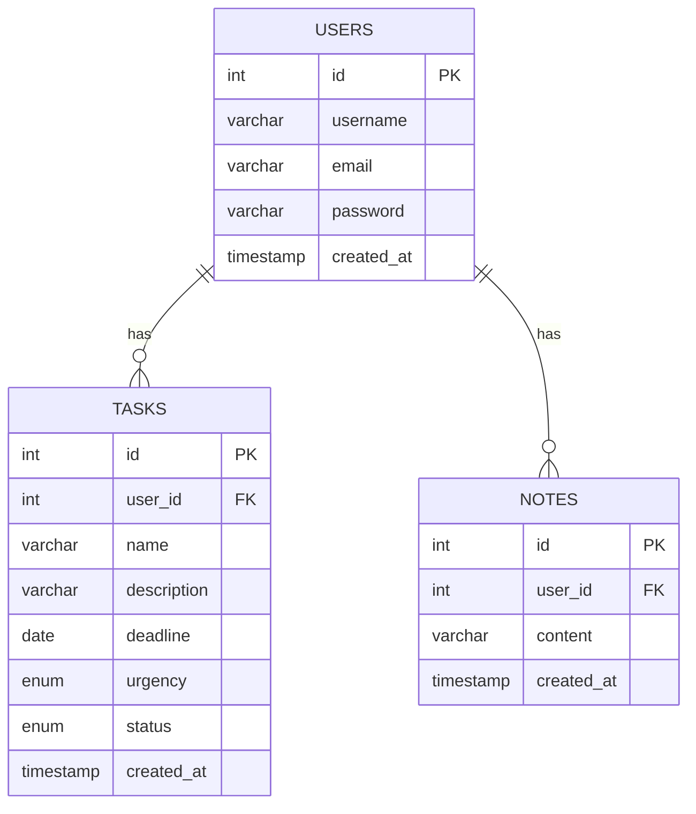

# 📑 TaskFlow

## 📌 Apresentação 
Desenvolvido para simplificar a rotina do usuário, o projeto TaskFlow oferece uma solução completa para organização de tarefas, permitindo o acompanhamento de prazos e status de forma prática e eficiente. 

Com foco na experiência do usuário (UX), a interface foi projetada para ser intuitiva, visualmente agradável e adaptável a diferentes dispositivos, garantindo acessibilidade e conforto em qualquer contexto. 

O site foi desenvolvido de forma Full-Stack. Isto é, a aplicação entrega tanto o desenvolvimento do back-end, o lado do servidor que lida com requisições de API e manipulações no banco de dados, quanto do front-end, voltado ao desenvolvimento da interface web. 

<a href="#" target="_blank"></a>
<a href="#" target="_blank"></a>
<a href="#" target="_blank"></a>

## 📋 Funcionalidades

A aplicação oferece uma interface gráfica intuitiva para o ciclo completo de gerenciamento de tarefas:

✍️ Criação de novos tarefas 
   
🔧 Edição de tarefas

👁️ Visualização em tempo real

🗑️ Exclusão controlada de tarefas

🔑 Sistema de proteção de rotas com middleware

🔒 Criptografia das senhas 

Todas as tarefas são armazenados e gerenciados diretamente no servidor do projeto. As funcionalidades do CRUD também se aplicam para o sistema de usuários e notas

## 💾 Banco de dados



## 🌐 API
Conheça as rotas de API do projeto

**Tarefas**
| Metodo | Rota | Descricao | Autenticacao |
|--------|------|-----------|--------------|
| GET | /tasks | Lista todas as tarefas de um usuario | Sim |
| GET | /tasks/:id | Filtra uma tarefa especifica | Sim |
| POST | /tasks/create | Adiciona uma nova tarefa | Sim |
| PUT | /tasks/editar/:id | Edita as informacoes de uma tarefa | Sim |
| DELETE | /tasks/:id | Deleta uma tarefa | Sim |

**Usuários**

| Metodo | Rota | Descricao | Autenticacao |
|--------|------|-----------|--------------|
| GET | /auth/me | Retorna os dados do usuario conectado atualmente | Sim |
| POST | /auth/register | Registra um novo usuario no banco | Nao |
| POST | /auth/login | Realiza o login de um usuario | Nao |
| PUT | /auth/edit | Edita os dados do usuario conectado atualmente | Sim |
| DELETE | /auth/delete | Deleta o usuario conectado atualmente | Sim |

Para as rotas que necessitam de autenticação, o próprio projeto lida com o envio do token do usuário após ele ter realizado o login.

Além disso, o sistema não permite visualizar, editar ou deletar tarefas de outros usuários.

## 🔴 Pré-requisitos
Para rodar o projeto TaskFlow localmente, você precisará ter os seguintes itens instalados em sua máquina:

1. Node.js

    Versão: 14.x ou superior (recomendado: 18.x LTS)

    Como verificar: `node --version`

    Download: [nodejs.org](https://nodejs.org/pt-br)

2. npm (Node Package Manager)

    Geralmente instalado junto com o Node.js

    Como verificar: `npm --version`

    Versão mínima: 6.x

4. SQLite3

    versão 8 instalada e rodando

    Como verificar: `mysql --version`

    Crie um usuário 


## 🗄️ Back-end
O back-end da aplicação, desenvolvido em Node.js, cria automaticamente o banco de dados e as tabelas necessárias na primeira execução. Para colocar o servidor em produção, é necessário seguir algumas etapas prévias:

1. Crie um arquivo ```.env``` na raiz do diretório com as seguintes variáveis:
    ```
    JWT_SECRET=sua_chave_secreta_para_access_token
    JWT_REFRESH_SECRET=sua_chave_secreta_para_refresh_token
    DB_USERNAME=<seu_usuario_sql>
    DB_PASSWORD=<sua_senha_sql>
    ```

2. Instale as dependências do projeto:
    ```
    npm install
    ```

3. Inicie o servidor:
    ```
    npm run start
    ```

## 🖥️ Front-end
O front-end da aplicação foi construido usando o framework React

## 👨‍💻 Desenvolvedor
Responsável pela criação do projeto

Diego - Programação e documentação <br>
Email: diego.dpab@gmail.com <br>
Conheça mais acessando o GitHub do desenvolvedor [aqui](https://github.com/Di3go07)!
